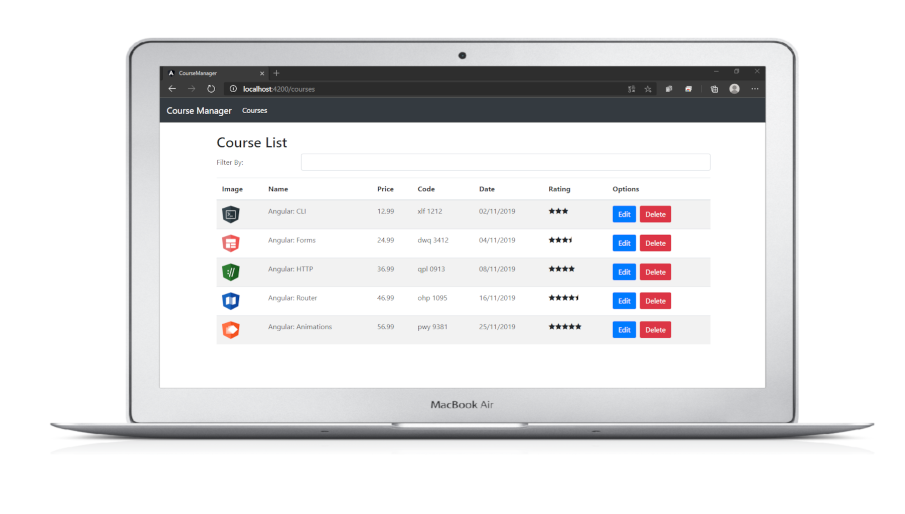

# ***CourseManager :computer:*** 

<h4 align=center>
  
</h4>

<div align=center>

![MIT][mit] ![Node_Badge][node_version_badge] ![Npm_Badge][npm_version_badge] ![NodeJS_Badge][server_nodejs_badge] [](https://github.com/ellerbrock/typescript-badges/)


  
  <a href="https://www.linkedin.com/in/luiz-carlos-vilela" target="_blank"> 
    
  </a>

</div>

<h3 align=center>
  
:books:
***Course Manager*** é um projeto para desenvolvimento de conhecimento na ***framework Angular*** ( Angular >= 9) e seus recursos. Desenvolvi todo o projeto utilizando as tecnologias ***TypeScript, Node, Angular e Bootstrap***

</h3>


<h1 align=center>
  
</h1>

<br /><br />


## ***:rocket: OBJETIVO***

<p align=justify> 
  <strong>Course Manager</strong> tem como objetivo ser um site de gerenciamento de cursos, com estudos na framework consegui desenvolver um <strong>site responsivo</strong> que com um <strong>CRUD</strong> - Create (Criação), Retrieve (Consulta), Update (Atualização) e Delete (Destruição) consegue manipular os dados a serem apresentados ao usuário, todos os dados vem de uma <strong>API RestFull</strong> criada por mim também. Desenvolvi todo o projeto utilizando as tecnologias <strong>TypeScript, Node, Angular e Bootstrap</strong>
  
</p>


## ***:computer: TECNOLOGIAS***

* ***Angular9 (Framework)***
* ***TypeScript (Linguagem de programação)***
* ***Bootstrap (Módulo front-end)***
* ***Font Awesome (Módulo front-end)***

### ***Configurações Iniciais***

Primeiro, você precisa ter o <kbd>[NodeJS](https://nodejs.org/en/download/)</kbd> instalado na sua máquina. 

Se você estiver utilizando o **Linux**, você pode optar por instalar o **Node** através do gerênciador de versões <kbd>[asdf]</kbd> para facilitar o processo de mudança da versão do **Node**, quando for necessário.

Você pode optar também por utilizar o **yarn** no lugar do **npm**. Você pode instalar clicando nesse <kbd>[link][yarn]</kbd>, ou através do <kbd>[asdf]</kbd>.


***Tendo o angular-cli instalado.***

``` 
 ng new project
```

**Instalando Bootstrap no projeto. Documentação [Boostrap-Oficial](https://getbootstrap.com/).**

```
npm install bootstrap
```
Colocar no CSS global `@import 'bootstrap/dist/css/bootstrap.min.css';`, agora você pode usar as classes do bootstrap em todo projeto.


**Instalando Front Awesome no projeto**
```
npm install font-awesome
```
Colocar no CSS global `@import 'font-awesome/css/font-awesome.min.css';`.

**Rodando aplicação**

Rodando `ng serve` para aplicação em desenvolvimento. Navegue para `http://localhost:4200/`.

## ***:star2: AGRADECIMENTOS***

<div align=center>


</div>

## ***:page_with_curl: LICENÇA***

Este repositório está licenciado pela **MIT LICENSE**. Para mais informações detalhadas, leia o arquivo [LICENSE](./LICENSE) contido nesse repositório. 

<i><h2 align="center">Feito com ❤️ por <a href="https://www.linkedin.com/in/luiz-carlos-vilela/">Luiz Carlos Vilela</a></h2></i>


[mit]: https://img.shields.io/badge/license-MIT-brightgreen

[github_issues_badge]: https://img.shields.io/github/issues/marcospbrandao/ecoleta?color=green

[repository_license_badge]: https://img.shields.io/github/license/marcospbrandao/ecoleta

[node_version_badge]: https://img.shields.io/badge/node-12.17.0-green

[npm_version_badge]: https://img.shields.io/badge/npm-6.14.4-red

[server_nodejs_badge]: https://img.shields.io/badge/server-nodejs-important
